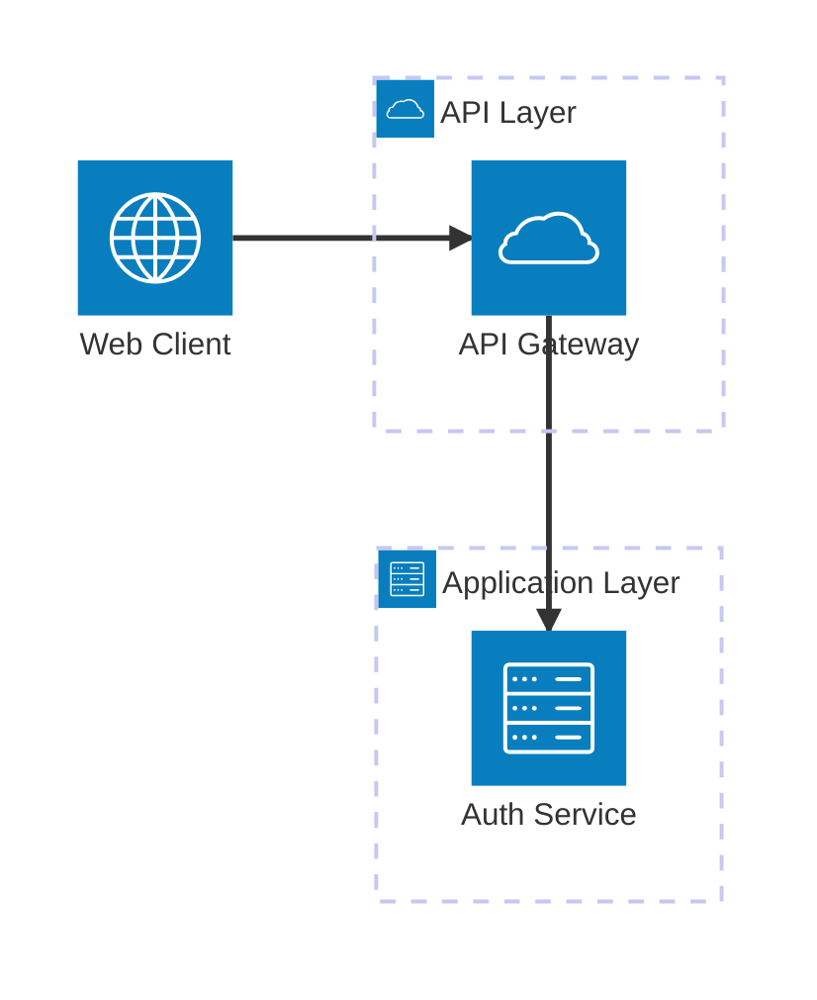

# DocBase Markdown 記法ルール

DocBase は CommonMark 準拠 + 独自拡張の Markdown を採用している。

## 基本ルール

- 本文の1行目にタイトルと同じ見出しを絶対に書かない
- 図表はテキスト罫線文字（`┌─┐│└` 等）ではなく Mermaid 記法を使う（DocBase での表示崩れ防止）
- 参考資料等の URL リンクを記載・更新する際は、`curl -sL <URL>` でページを取得し以下を検証する
  - リンクテキストとページの実際の `<title>` が一致しているか
  - 引用したページの内容が記事の文脈に対して妥当か（リンク切れ・内容変更の検出）

---

## DocBase 独自拡張（標準 Markdown にない機能）

### 差し込み機能（メモの引用・埋め込み）

```
#{メモID}
#{メモURL}
```

- **必ず前後に改行が必要**（インラインでは使えない）

```markdown
<!-- OK -->
前のテキスト

#{12345}

後のテキスト

<!-- NG: すべて動作しない -->
前のテキスト #{12345} 後のテキスト
前のテキスト #{12345}
#{12345} 後のテキスト
```

### 画像サイズ指定

URL の後に半角スペース + `=幅x高さ` で指定。`x` は半角アルファベット。

```markdown
  <!-- 幅100px × 高さ100px -->
     <!-- 幅100px、高さ自動 -->
     <!-- 幅自動、高さ100px -->
     <!-- フルサイズ表示 -->
```

### コードブロックにファイル名

言語指定の後に `:ファイル名` を付ける。

````markdown
```ruby:sushi.rb
def sushi
  puts 'お寿司'
end
```
````

### テンプレート変数

メモのテンプレート機能で使用可能:

```
%{Year}  %{month}  %{day}  %{name}
```

調整: `%{Year:+1y}` で翌年

---

## HTML タグによる装飾

### 文字色・サイズ

```markdown
<span style="color:green;">緑のテキスト</span>
<span style="font-size:150%;">大きいテキスト</span>
```

### 下線

```markdown
<u>下線テキスト</u>
```

### ハイライト

```markdown
<mark>ハイライトテキスト</mark>
```

### 折りたたみ

```markdown
<details>
<summary>詳細を見る</summary>

- 寿司
  - エンガワ
  - 炙りサーモン

</details>
```

`<summary>` と内容の間に空行を入れると Markdown が正しくレンダリングされる。

---

## 数式（MathJax / TeX 記法）

### ブロック数式

コードブロックの言語指定を `math` にする:

````markdown
```math
\begin{equation}
E = mc^2
\end{equation}
```
````

### 1行数式

```markdown
$$ e^{i\theta} = \cos\theta + i\sin\theta $$
```

### インライン数式

```markdown
$ e^{i\theta} = \cos\theta + i\sin\theta $
```

### 注意: `_` のエスケープ

数式内の `_` が Markdown の斜体と認識される場合がある。`\_` にエスケープすること。

```markdown
<!-- NG --> $E'_R$, $E'_G$
<!-- OK --> $E'\_R$, $E'\_G$
```

---

## PlantUML

DocBase ではコードブロックの言語指定を **`uml`** にすると PlantUML が描画される（`plantuml` ではない）。

````markdown
```uml
@startuml
Alice -> Bob : こんにちは
@enduml
```
````

- 図の種類ごとに開始・終了タグが異なる:
  - UML 図全般: `@startuml` / `@enduml`
  - マインドマップ: `@startmindmap` / `@endmindmap`
  - ガントチャート: `@startgantt` / `@endgantt`
  - ワイヤーフレーム: `@startsalt` / `@endsalt`

---

## チェックボックスの注意点

半角の `(` が続く場合、`\` でエスケープが必要:

```markdown
- [ ] \(abc)
```

---

## Mermaid 図表

コードブロックの言語指定を `mermaid` にする。DocBase 固有の注意点のみ記載。

### DocBase 固有の注意点

- DocBase の Mermaid バージョンが最新でない場合があり、新しい構文が使えないことがある
- コードブロックの前後に**空行を入れる**とレンダリングが改善することがある
- 非常に複雑な図はレンダリングに失敗するため、適切に分割する
- 日本語ラベルで問題が出る場合は引用符（`"`）で囲む

### architecture-beta（アーキテクチャダイアグラム）

比較的新しい図表タイプ。独特の構文を持つ。

````markdown

````

- **group**: `group {id}({icon})[{title}] (in {parent})?`
- **service**: `service {id}({icon})[{title}] (in {parent})?`
- **edge**: `{serviceId}:{T|B|L|R} --> {T|B|L|R}:{serviceId}`
- **junction**: `junction {id} (in {parent})?` - エッジの分岐点
- **デフォルトアイコン**: `cloud`, `database`, `disk`, `internet`, `server`
- **拡張アイコン**: iconify-json/logos が利用可能
