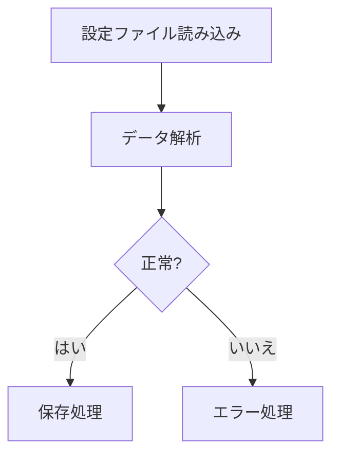
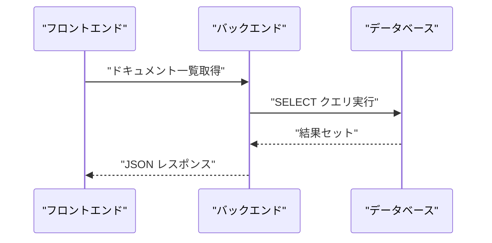
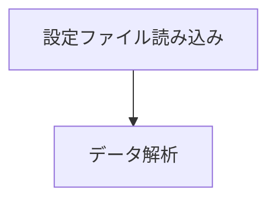
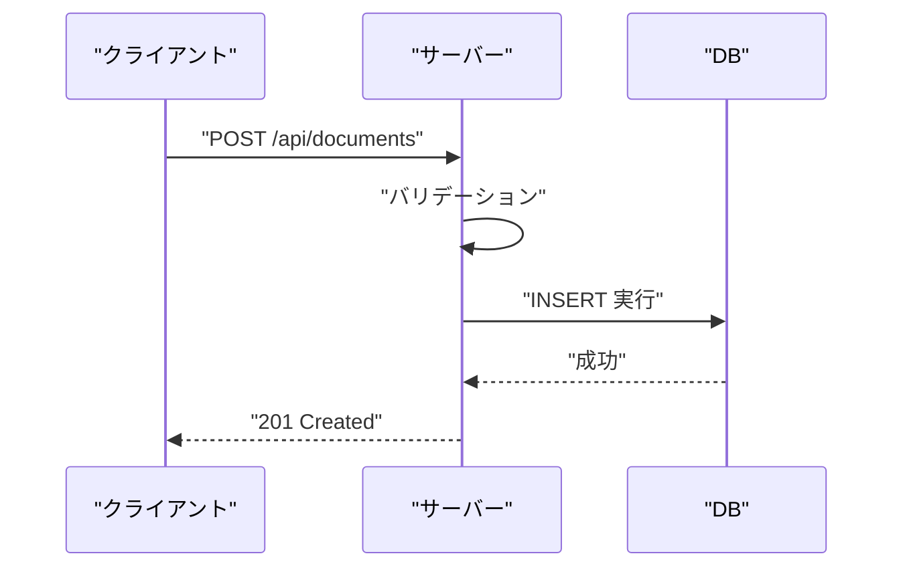
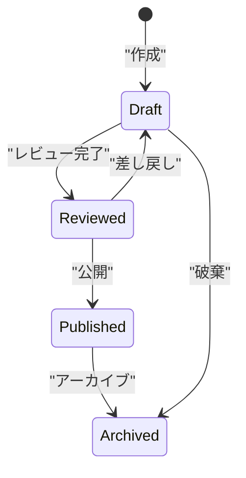
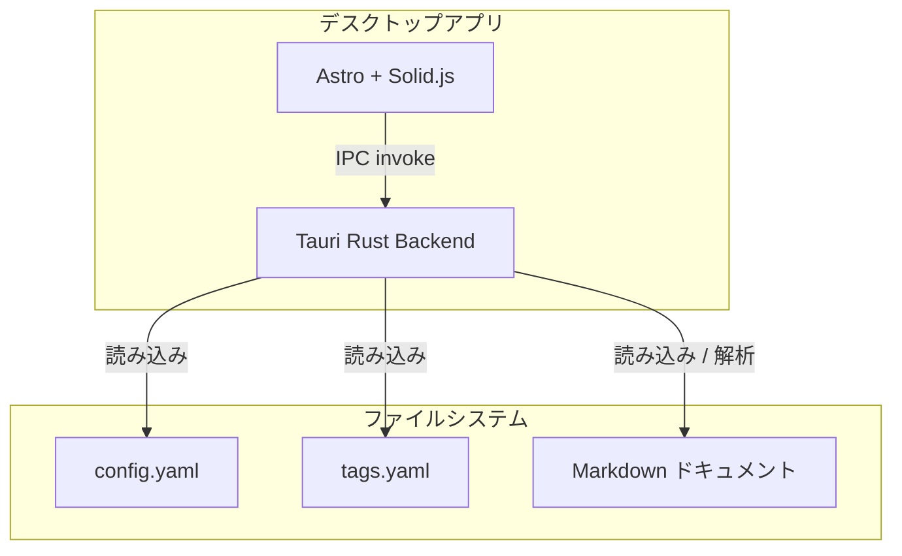

# Mermaid Knowledge - 図解生成・検証

## Overview

ナレッジドキュメント向けに Mermaid 図解を生成し、**パース検証を行ってからドキュメントに挿入する**スキル。

Mermaid は日本語テキストや特殊記号でパースエラーを起こしやすいため、このスキルでは生成 → 検証 → 修正のサイクルを必ず回す。

## When to Use

- ナレッジドキュメントに図解を追加する際
- ユーザーが「図解を入れて」「ダイアグラムを作って」「mermaid で描いて」と指示したとき
- アーキテクチャ図、フロー図、シーケンス図、ER図などの視覚的説明が有効な場面

## Instructions

### Step 1: 図解の種類を選定

ドキュメントの内容に応じて適切な図の種類を選ぶ:

| 図の種類 | Mermaid 構文 | 適用場面 |
|---------|------------|---------|
| フローチャート | `flowchart TD` | 処理フロー、意思決定 |
| シーケンス図 | `sequenceDiagram` | API呼び出し、通信フロー |
| クラス図 | `classDiagram` | データモデル、構造体 |
| 状態遷移図 | `stateDiagram-v2` | 状態管理、ライフサイクル |
| ER図 | `erDiagram` | データベース設計 |
| ガントチャート | `gantt` | スケジュール、フェーズ |
| ブロック図 | `block-beta` | システム構成、レイヤー |

### Step 2: Mermaid コードを生成

以下の **日本語安全ルール** を厳守して生成する:

#### 必須ルール: 日本語テキストは必ずダブルクォートで囲む



#### 禁止パターンと対処法

| 禁止 | 理由 | 対処 |
|------|------|------|
| `A[設定ファイル]` | 日本語がクォートなし | `A["設定ファイル"]` |
| `A["文字列(括弧付き)"]` | 括弧がパーサーを混乱 | `A["文字列（全角括弧）"]` |
| `-->|はい|` | ラベルがクォートなし | `-->\|"はい"\|` |
| `A["He said "hello""]` | ネストしたダブルクォート | `A["He said 'hello'"]` |
| `note over A: 日本語メモ` | note 内の日本語 | `note over A: "日本語メモ"` |
| `A --> B: 処理実行` | エッジラベルの日本語 | `A -->\|"処理実行"\| B` |
| `participant 認証サービス` | participant名の日本語 | `participant Auth as "認証サービス"` |

#### 記号の安全対策

- 半角括弧 `()` → 全角 `（）` に変換
- 半角 `<>` → 全角 `＜＞` に変換
- `&` → `and` に変換
- `#` → ノード名内では使わない
- `%` → `percent` に変換
- バッククォート → シングルクォートに変換

#### シーケンス図の安全パターン



### Step 3: Mermaid CLI で検証

生成したコードを **必ず** Mermaid CLI (`mmdc`) で検証する。

#### 検証手順

1. 一時ファイルに Mermaid コードを書き出す:

```bash
cat > /tmp/mermaid-test.mmd << 'MERMAID_EOF'
（ここに Mermaid コード）
MERMAID_EOF
```

2. `mmdc` で SVG 出力を試みる:

```bash
npx -y @mermaid-js/mermaid-cli mmdc -i /tmp/mermaid-test.mmd -o /tmp/mermaid-test.svg 2>&1
```

3. 結果を確認:
   - 成功: SVG ファイルが生成される → Step 4 へ
   - 失敗: エラーメッセージを解析 → Step 3b へ

#### Step 3b: エラー修正

よくあるエラーと修正方法:

| エラーメッセージ | 原因 | 修正 |
|----------------|------|------|
| `Parse error on line N` | クォート忘れ、記号問題 | 該当行の日本語をダブルクォートで囲む |
| `Expecting 'NEWLINE'` | 構文の区切り不正 | 改行と空白を見直す |
| `Lexical error on line N` | 不正な文字 | 半角記号を全角に置換 |
| `Unknown diagram type` | 図の種類の typo | `flowchart`, `sequenceDiagram` 等の正しい名前を使う |

修正後、再度 Step 3 の検証を行う。**最大3回まで**リトライし、それでも失敗する場合はシンプルな英語ラベルに書き換えて対応する。

### Step 4: ドキュメントに挿入

検証済みの Mermaid コードを Markdown のコードブロックとして挿入:

````markdown

````

#### 挿入位置のガイドライン

- **概要セクションの直後**: 全体像を示すアーキテクチャ図
- **処理フローの説明前**: フローチャートやシーケンス図
- **データモデルの説明前**: ER図やクラス図
- **図の直後に簡潔な説明文を添える**

### Step 5: 最終確認

- [ ] すべての日本語テキストがダブルクォートで囲まれている
- [ ] 半角括弧 `()` が含まれていない（全角 `（）` に置換済み）
- [ ] `mmdc` で SVG 出力が成功した
- [ ] ドキュメント内の文脈に合った図解になっている

## Examples

### Example 1: API フローの図解



### Example 2: 状態遷移図



### Example 3: システム構成図



## Guidelines

- すべての日本語テキストは必ずダブルクォートで囲む
- 半角括弧 `()` は全角 `（）` に、半角 `<>` は全角 `＜＞` に変換する
- `mmdc` による検証を省略しない（生成 → 検証 → 修正のサイクルを必ず回す）
- 検証リトライは最大3回まで。それでも失敗する場合は英語ラベルに書き換える
- 図の直後に簡潔な説明文を添える
